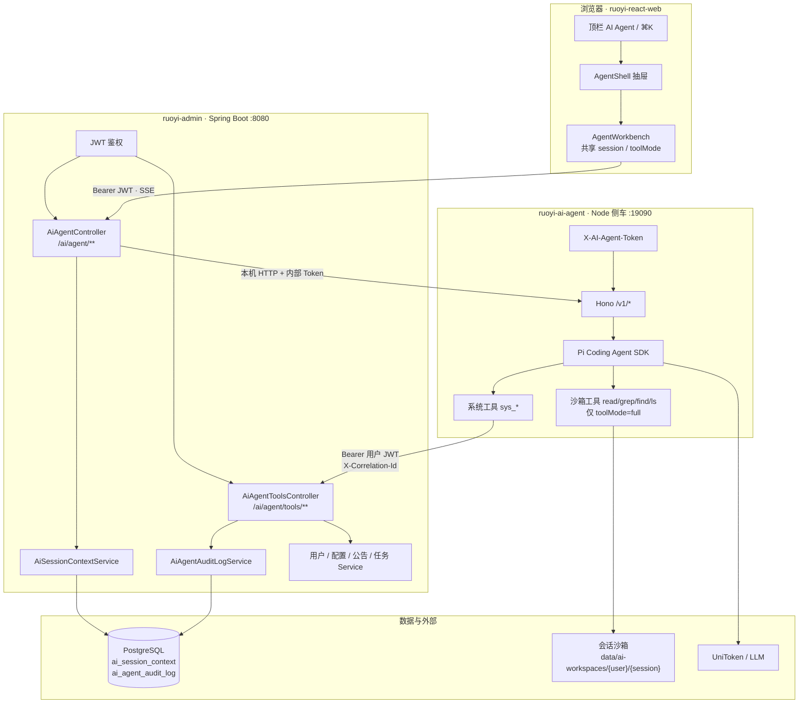
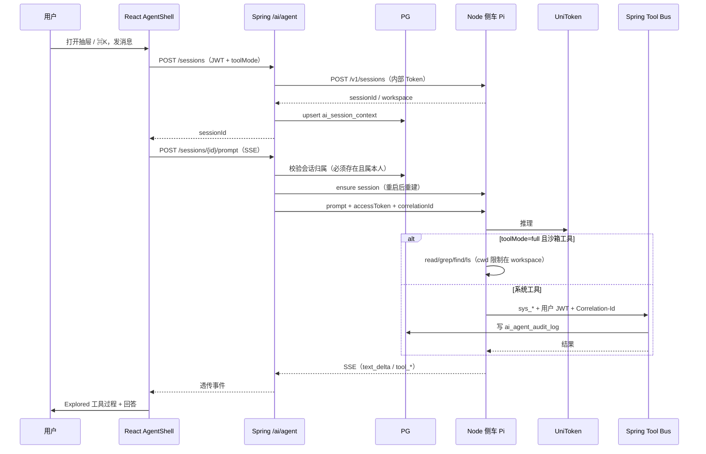

# AI Agent 架构

产品主入口为顶部 Navbar（机器人图标 / ⌘·Ctrl+K）的 AgentShell 抽屉。`ruoyi-ai-agent` 是独立 Node 侧车，不是嵌入 `ruoyi-admin` 的子模块。

## 总览



## 一次对话链路



## 分层职责

| 层 | 工程 / 模块 | 职责 |
|----|-------------|------|
| 交互 | 顶栏 + `AgentShell` + 共享 store | 全局入口；业务/沙箱模式；历史会话；流式展示 |
| 网关 | `AiAgentController` | JWT、会话归属、ensure 重建、代理 SSE、内部 Token |
| 工具总线 | `AiAgentToolsController` | 只读业务 API + 审计 |
| 引擎 | `ruoyi-ai-agent` | Pi 会话、LLM、工具模式、沙箱路径隔离 |
| 存储 | `ai_session_context` / `ai_agent_audit_log` | 会话元数据；工具调用审计 |
| 模型 | UniToken 等 | 侧车环境变量配置 |

## 安全与运维

| 项 | 说明 |
|----|------|
| 绑定 | 默认 `127.0.0.1`；非 loopback 需 `AI_AGENT_ALLOW_REMOTE=1` |
| 内部鉴权 | `X-AI-Agent-Token`，admin 与侧车共享 `AI_AGENT_INTERNAL_TOKEN` |
| 会话归属 | prompt/abort 必须 PG 元数据存在且 userId 匹配 |
| 工具模式 | `business`（默认，仅 sys_*）/ `full`（sys_* + 沙箱） |
| 沙箱隔离 | workspace 必须落在 `data/ai-workspaces/` 下 |
| 审计 | Tool Bus 写入 `ai_agent_audit_log`（correlationId / 耗时 / 成败） |
| 启停 | `./scripts/ruoyi-dev.sh`（或 `cd ruoyi-ai-agent && npm start`） |

## 配置

```yaml
# application.yml
ruoyi.ai.agent:
  base-url: ${AI_AGENT_BASE_URL:http://127.0.0.1:19090}
  internal-token: ${AI_AGENT_INTERNAL_TOKEN:ruoyi-ai-agent-dev-token}
  tool-mode: ${AI_AGENT_TOOL_MODE:business}
```

侧车环境变量：`AI_AGENT_INTERNAL_TOKEN`、`AI_AGENT_TOOL_MODE`、`AI_AGENT_GATEWAY_URL`、`AI_API_*`。

## 关键路径

| 区域 | 路径 |
|------|------|
| 侧车 | `ruoyi-ai-agent/src/{server,sessions,config,system-tools}.js` |
| 启停 | `scripts/ruoyi-dev.sh`；Agent 亦可 `npm start` |
| 网关 / 工具 | `ruoyi-admin/.../controller/ai/*` |
| 会话 / 审计 | `ruoyi-system/.../AiSessionContext*`、`AiAgentAuditLog*` |
| 前端 | `AgentShell`、`AgentWorkbench`、`store/agentShellStore.js` |
| SQL | `sql/ry-demo-postgresql.sql`（终版，含 Agent 审计表） |

## 设计要点

- 并列侧车 + 本机 HTTP，浏览器只访问 Spring
- 默认业务模式，避免 Agent 去扫宿主机仓库
- 侧车重启后通过 `ensure` + PG 元数据重建会话（对话上下文不跨进程持久化到 Pi）
- 写操作 / MCP / 多 Agent 不在当前范围
